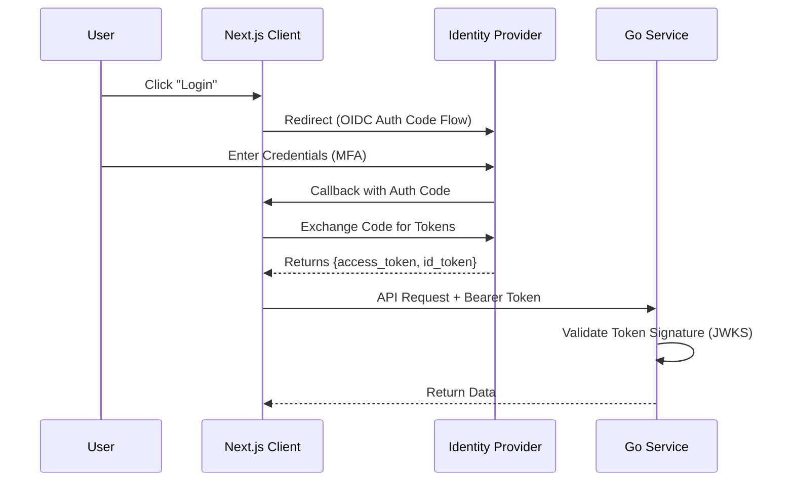
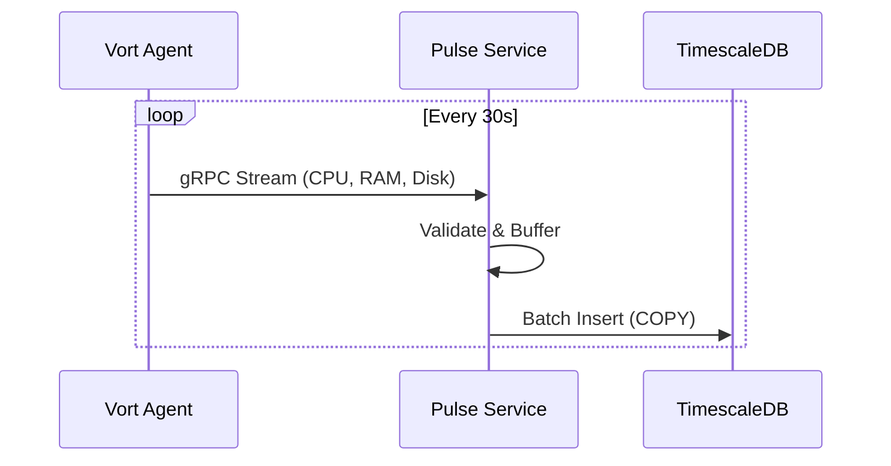
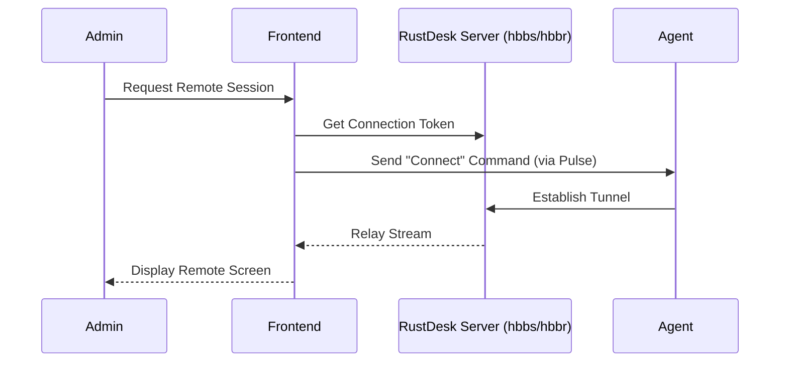
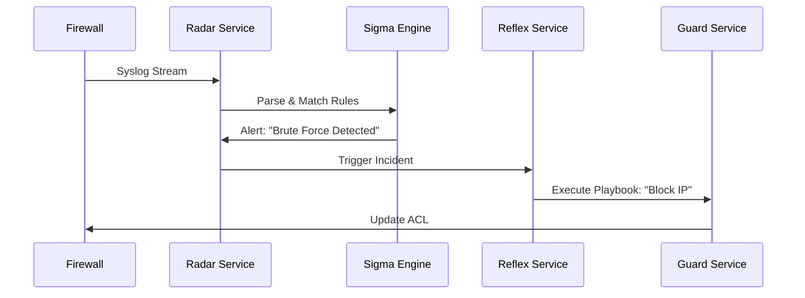

# Data Flow

This document visualizes the data flow through the Vortyx architecture.

## 1. Authentication Flow (Frontend -> Zitadel -> Backend)

## 2. Telemetry Ingestion (Agent -> Pulse -> TimescaleDB)

## 3. Remote Desktop (User -> RustDesk -> Agent)

## 4. Threat Detection (Log -> Radar -> Reflex)

