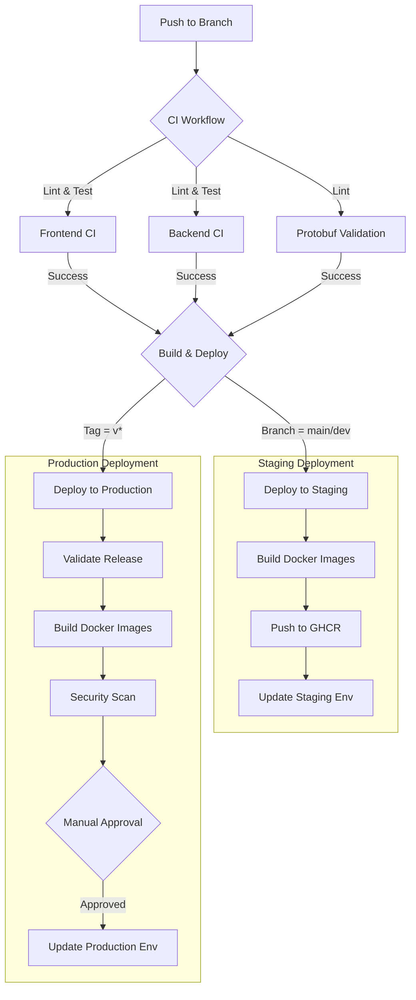

# CI/CD Pipeline Architecture

This document details the Continuous Integration and Continuous Deployment (CI/CD) pipeline for the Vortyx platform. The pipeline is built on **GitHub Actions** and is designed to ensure code quality, security, and reliable deployments across environments.

## 1. Pipeline Overview

The Vortyx CI/CD pipeline follows a **GitOps** approach where code changes trigger automated workflows that test, build, and deploy the application.

### Key Components

-   **Source Control**: GitHub (Repository: `Aziz-Hubs/vortyx`)
-   **CI/CD Engine**: GitHub Actions
-   **Container Registry**: GitHub Container Registry (GHCR)
-   **Environments**:
    -   **Development**: Local environment (Docker Compose)
    -   **Staging**: Automatically deployed from `main` and `dev` branches
    -   **Production**: Manually approved deployments from Releases

### Workflow Diagram

## 2. Workflows

The pipeline consists of several specialized workflows located in `.github/workflows/`.

### A. Continuous Integration (CI)
**File**: `ci.yml`
**Triggers**: Push/PR to `main`, `dev`

This workflow ensures code quality before any code is merged or deployed.

| Job | Description | Tools Used |
| :--- | :--- | :--- |
| **Frontend CI** | Lints, type-checks, and tests the Next.js application. | `eslint`, `tsc`, `npm test` |
| **Backend CI** | Lints, tests, and verifies build for the Go backend. | `golangci-lint`, `go test`, `go build` |
| **Protobuf Validation** | Lints `.proto` files and checks for breaking changes. | `buf lint`, `buf breaking` |
| **Dependency Review** | Scans for vulnerable dependencies (PRs only). | `dependency-review-action` |

### B. Deploy Staging
**File**: `deploy-staging.yml`
**Triggers**: Push to `main`, `dev`

This workflow automatically deploys successful builds to the staging environment.

1.  **Validate**: Checks which components (frontend/backend) have changed.
2.  **Build**: Uses the **Reusable Build Workflow** to build and push Docker images to GHCR.
    -   Images are tagged with the branch name (e.g., `staging`, `dev`).
    -   Optimized to only rebuild changed components (smart build).
3.  **Deploy**: Updates the staging environment with the new image tags.

### C. Deploy Production
**File**: `deploy-production.yml`
**Triggers**: Release Published (`v*` tag) or Manual Dispatch

This workflow handles production deployments with strict quality gates.

1.  **Validate Release**: Verifies the version tag (SemVer) and determines if it's a pre-release.
2.  **Build**: Builds and pushes Docker images with version tags (e.g., `v1.0.0`) and `latest`.
3.  **Security Scan**: Runs `trivy` to scan the built artifacts for critical vulnerabilities.
4.  **Pre-deployment Check**: Verifies environment health before proceeding.
5.  **Approval Gate**: Pauses the workflow and requires manual approval from an authorized environment administrator.
6.  **Deploy**: Updates the production environment after approval.

### D. Helper Workflows
-   **Reusable Build** (`reusable-build.yml`): A centralized workflow logic for building and pushing Docker images. Used by both Staging and Production workflows to ensure consistency (DRY principle).
-   **Security Scan** (`security.yml`): Runs weekly scheduled scans (CodeQL, Trivy) to detect vulnerabilities in the codebase.
-   **Dependency Updates** (`dependency-updates.yml`): Weekly check for outdated dependencies and auto-creation of PRs.

## 3. Deployment Procedures

### Staging Deployment
Staging deployment is **fully automated**.
1.  Developer pushes code to `dev` or merges a PR to `main`.
2.  GitHub Actions triggers `CI` and `Deploy Staging`.
3.  If tests pass, images are built and pushed to GHCR.
4.  Staging environment is updated.

### Production Deployment
Production deployment is **manual and gated**.
1.  Create a new Release in GitHub with a tag (e.g., `v1.2.0`).
2.  GitHub Actions triggers `Deploy Production`.
3.  CI/Build steps run automatically.
4.  The workflow **pauses** at the "Approval Gate".
5.  Admins review the deployment request in GitHub Actions UI.
6.  Upon approval, the deployment proceeds to update Production.

## 4. Environment Configuration

The pipeline relies on GitHub Repository Secrets and Variables to configure the environments.

### Secrets (Encrypted)
Managed in `Settings > Secrets and variables > Actions > Secrets`.

| Secret | Description | Required Scope |
| :--- | :--- | :--- |
| `STAGING_DATABASE_URL` | Connection string for Staging DB. | Staging |
| `PRODUCTION_DATABASE_URL` | Connection string for Production DB. | Production |
| `STAGING_ZITADEL_URL` | URL for Staging Identity Provider. | Staging |
| `PRODUCTION_ZITADEL_URL` | URL for Production Identity Provider. | Production |
| `SNYK_TOKEN` | (Optional) Token for Snyk security scanning. | All |

### Variables (Plain Text)
Managed in `Settings > Secrets and variables > Actions > Variables`.

| Variable | Description | Required Scope |
| :--- | :--- | :--- |
| `STAGING_API_URL` | Public API URL for Staging. | Staging |
| `PRODUCTION_API_URL` | Public API URL for Production. | Production |

## 5. Rollback Strategies

In case of a failed deployment or critical bug, use the following rollback strategies:

### A. Automatic Rollback (Infrastructure)
If the deployment step fails (e.g., Kubernetes apply fails), the orchestrator should automatically roll back to the previous stable revision.

### B. Manual Rollback (Image Revert)
To revert to a previous version:
1.  Identify the previous working image tag (e.g., `v1.1.0`).
2.  Manually trigger the `Deploy Production` workflow (using `workflow_dispatch`).
3.  Input the version `v1.1.0` to re-deploy that specific version.

### C. Database Rollback
Database migrations should always include a `down` migration.
-   **Staging**: Can be automated or manual via `task migrate:down`.
-   **Production**: **Manual intervention required**. Assess data loss risks before reverting schema changes.

## 6. Monitoring & Alerts

-   **Workflow Status**: GitHub sends email notifications for failed workflows.
-   **Deployment Status**: Check the "Actions" tab for real-time deployment logs.
-   **Health Checks**: The deployment jobs verify that the service is up (HTTP 200 OK) before marking the deployment as successful.

## 7. Troubleshooting Common Failures

| Error | Likely Cause | Resolution |
| :--- | :--- | :--- |
| **`golangci-lint exit with code 3`** | Linter configuration error or timeout. | Check `.golangci.yml` or increase timeout. |
| **`Process completed with exit code 1` (Frontend)** | ESLint or TypeScript errors. | Run `npm run lint` locally and fix issues. |
| **`buf breaking` failed** | Breaking change in `.proto` files. | Revert breaking change or update major version (v1 -> v2). |
| **`Not Found` (Protobuf Validation)** | Invalid `buf-setup-action` version. | Ensure `v1.28.1` is used in `ci.yml`. |
| **Deployment Skipped** | No changes detected in frontend/backend. | Force deployment via `workflow_dispatch` if needed. |
